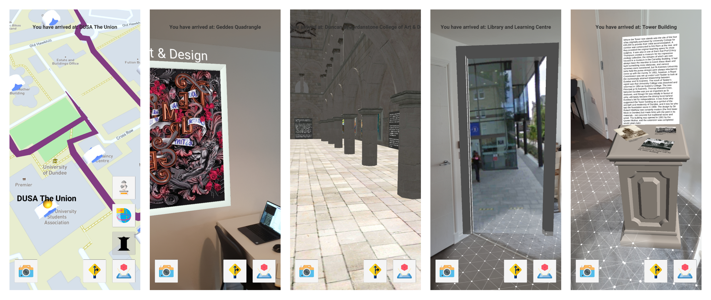

# University of Dundee TouAR
### Honours Project 2019/2020 - Augmented Reality tour around campus

## 1. Description
Mobile Augmented Reality application built using Unity3D, Google ARCore and Mapbox. This project was part of my honours coursework at the University of Dundee during the 2019/2020 academic year and thus contains both source code and other appendices. 

The application takes users on a historic tour around the university campus. There are 4 different routes available for the tour, each focused around one of the main teaching areas of the institution. The path navigates around the major buildings, offering Augmneted Reality interactions at each location.

## 2. User Manual

Download and install the <a href="https://dmail-my.sharepoint.com/:u:/g/personal/kvzmarshalov_dundee_ac_uk/EY2nbH4gajlGsHJaSFqUEp8Bm_sCXCmCvFnhvMD2Nd07Ew?e=ePGh7n">Build.apk</a> file onto an [AR Core supported device](https://developers.google.com/ar/discover/supported-devices). It might be necessary to enable the installation of third-party apks in the device settings. 

Once launched, please give the application permissions to use Location data and the Camera. A popup should appear that requests the permissions when in the map view and on one of the Augmented Reality interactions. 

The map view displays the available points of interest, which are associated with buildings on the University of Dundee campus. 

1. Navigate to that building in real life in order to be presented with the available interactions. Alternatively, use a GPS mocking application on your Android device and change your coordinates according to the Coordinates.txt file
2. Press the yellow road sign icon at the bottom right of the screen in order to begin the Select Path interaction. 

    **Note**: The same interaction will be available throughout the selected path, which will allow you to change routes.

3. Look around and find the pictures associated with the paths passing through the current node. 
4. Select a path by pressing the picture. This will return the application to the map view and display the points of interest on the path.
5. Press on the AR Interactions button in the bottom right of the screen to display the available interactions for the node. 
6. Select an interaction.
7. Find a horizontal surface to display the Augmented Reality objects on. Recognised surfaces are marked with a grey mesh on screen. Pressing on the surface will spawn the interaction.
8. Going back to the map is done by clicking on the camera icon in the bottom left corner of the screen, followed by a click on the map icon in the same position

Note that points of interest can only be visited once, regardless of the selected route.

## 3. Licensing

All resources used in the project are for educational purposes only and are owned by their respective owners. All copyrights belong to them. The list below contains citations to the resources used within the application:

<a href="https://skfb.ly/6SsGS" target="_blank">"3D Architecture | Photo frame"</a> by <a> Dylan Dreyer Varsics</a> is licensed under <a href="http://creativecommons.org/licenses/by/4.0" target="_blank">CC BY 4.0</a>

<a href="https://sketchfab.com/DundeeDental" target="_blank">"3D Dentistry Models"</a> by <a href="https://sketchfab.com/DundeeDental" target="_blank"> University of Dundee, School of Dentistry</a> is licensed under <a href="http://creativecommons.org/licenses/by/4.0" target="_blank">CC BY 4.0</a>

<a href="https://sketchfab.com/uod_museums" target="_blank">"3D Models"</a> by <a href="https://sketchfab.com/uod_museums" target="_blank"> University of Dundee Museum Collections</a> is licensed under <a href="http://creativecommons.org/licenses/by/4.0" target="_blank">CC BY 4.0</a>

<a href="https://artuk.org/discover/artworks/search/collectionx:university-of-dundee-duncan-of-jordanstone-college-collection-1446" target="_blank">"All artwork is form Art UK"</a> by <a>various authors</a>, <a href="https://www.dundee.ac.uk/djcad/" target="_blank">University of Dundee, Duncan of Jordanstone College Collection</a> is licensed under <a href="http://creativecommons.org/licenses/by-nc-nd/4.0" target="_blank">CC BY-NC-ND 4.0</a>

<a href="https://www.behance.net/gallery/70910597/Demiurge-33" target="_blank">"Demiurge-33"</a> by <a href="https://www.behance.net/kattphatt" target="_blank">Katt Phatt</a> is licensed under <a href="http://creativecommons.org/licenses/by-nc-nd/4.0" target="_blank">CC BY-NC-ND 4.0</a>

<a href="https://www.newscientist.com/term/dna/" target="_blank">"KTSDESIGN/SCIENCE PHOTO LIBRARY/Getty"</a> is licensed under <a href="http://creativecommons.org/licenses/by/4.0" target="_blank">CC BY 4.0</a>

<a href="https://www.independent.co.uk/voices/mental-health-crisis-world-social-work-day-depression-anxiety-support-community-care-a8264666.html" target="_blank">"Mental Health"</a> by <a href="https://www.independent.co.uk/voices/mental-health-crisis-world-social-work-day-depression-anxiety-support-community-care-a8264666.html" target="_blank">Getty</a> is licensed under <a href="http://creativecommons.org/licenses/by/4.0" target="_blank">CC BY 4.0</a>

<a href="https://en.wikipedia.org/wiki/Andrew_Carnegie#/media/File:Andrew_Carnegie,_three-quarter_length_portrait,_seated,_facing_slightly_left,_1913.jpg" target="_blank">"Andrew Carnegie, American businessman and philanthropist."</a> by <a>Theodore C. Marceau </a> is in the <a href="https://wiki.creativecommons.org/Public_domain" target="_blank">Public Domain</a>

Patrick Geddes: Luminary or Prophet of Demonic Planning - Scientific Figure on ResearchGate. Available from: https://www.researchgate.net/figure/Patrick-Geddes-online-at-wwwpatrickgeddescentreorguk-accessed-29-July-2019_fig1_338066777 [accessed 26 Apr, 2020] 

<a href="https://www.turbosquid.com/3d-models/free-max-model-architectural-modules/767833">Pedestal</a> by Roombaroom

<a href="https://www.turbosquid.com/3d-models/3d-door-1323686">3D Door</a> by 
uEhelp

All icons from various users at  www.flaticon.com. 

Google Street View panoramas are owned by Google and/or by their respective owners. All copyrights belong to them.

All other materials are owned by the Dundee University Archive Services and/or by their respective owners. All copyrights beling to them.
